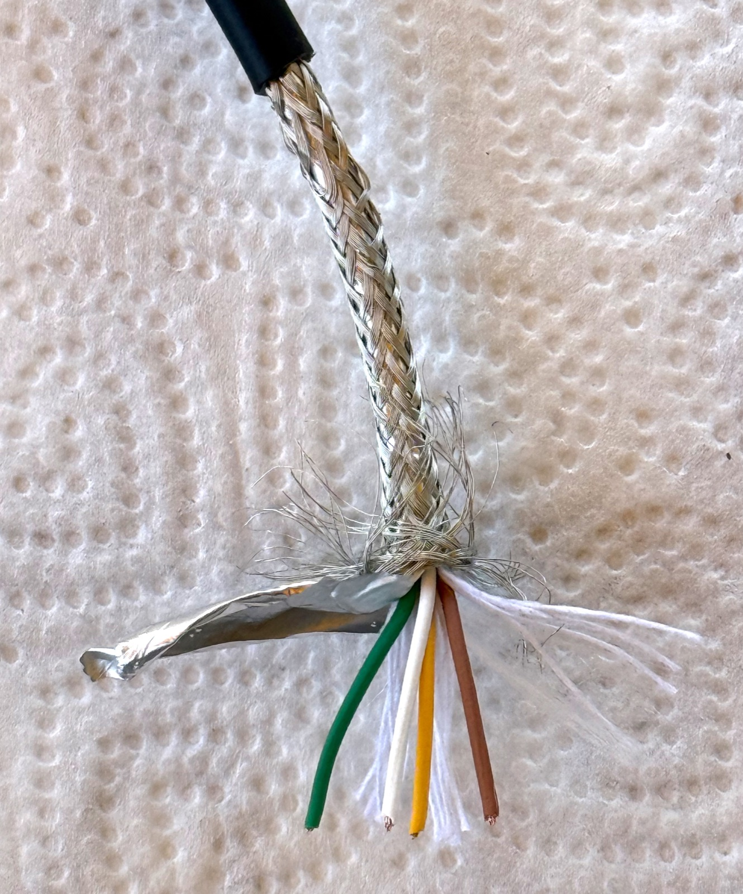
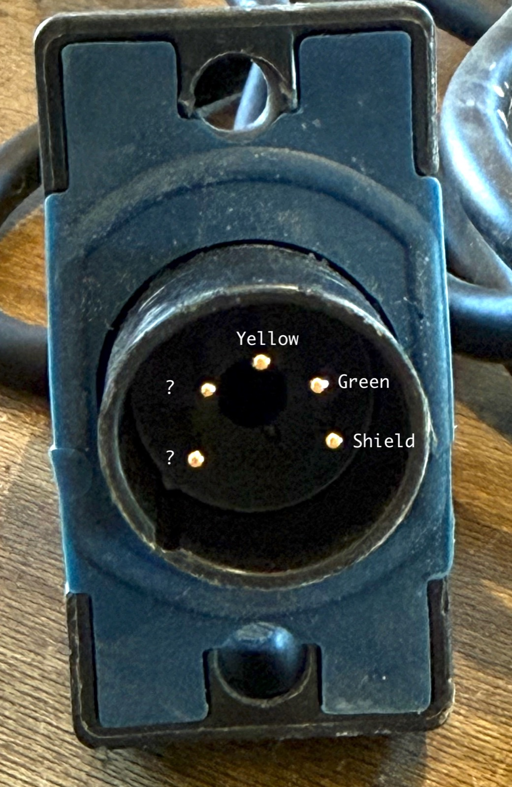
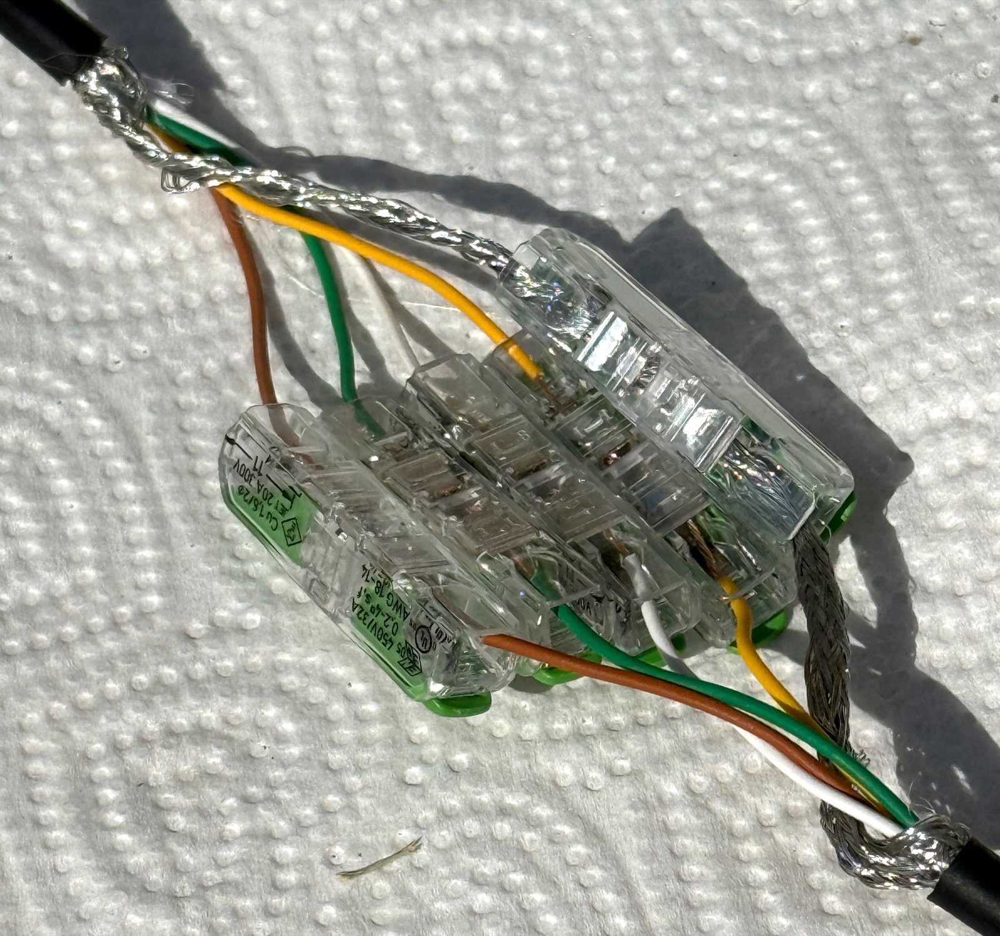

# OASE EGC Cable Construction and Splicing

## Scope

This note records observations from cutting and successfully splicing one OASE
EGC cable. It is based on inspection, continuity measurements, and a live
hardware test. It is not official OASE documentation, and other cable or
connector revisions may differ.

## Cable construction

The inspected cable has an outside diameter of approximately **5.5 mm**. From
outside to inside, it contains:

1. Black outer jacket
2. Woven metallic braid shield
3. Foil shield
4. Four stranded copper conductors
5. Fibrous filler/binder material

The four conductor insulation colors are:

- Brown
- White
- Yellow
- Green

*Cut EGC cable showing the woven braid, foil shield, four color-coded
conductors, and fibrous filler.*

## Connector continuity observations

The molded connector has five pins. With the male pins facing the observer and
the rectangular housing oriented as shown in the inspection photograph:

- The top pin has direct continuity to the yellow conductor.
- The upper-right pin has direct continuity to the green conductor.
- The lower-right pin has direct continuity to the braid shield.
- Neither of the two left-side pins has direct DC continuity to the brown or
  white conductor.

*Male connector face in the orientation used for the continuity description.
The two pins marked with question marks had no direct DC continuity to either
the brown or white conductor.*

A diode test also found no simple diode junction between the brown/white
conductors and the two unidentified pins.

These results suggest that the molded connector housing may contain an
encapsulated component or interface circuit between the brown/white conductors
and the two unidentified pins. This has not been proven, and the internal
implementation is not required in order to splice the cable on the cable side
of the connector.

## Successful splice test

The cable was cut and the four insulated conductors were reconnected
color-for-color using four WAGO 221-2411 inline lever connectors:

| First cable end | Second cable end |
| --- | --- |
| Brown | Brown |
| White | White |
| Yellow | Yellow |
| Green | Green |

The connected EGC device operated correctly during the test. It worked even
though the braid and foil shields had not yet been reconnected around the
temporary splice.

*Temporary WAGO 221-2411 test splice. The device operated with the four
conductors connected color-for-color and the shields left open. This photograph
shows the functional test, not the final shielded and environmentally sealed
installation.*

This confirms for the tested cable that:

- The four insulated conductors carry everything required for normal
  operation.
- The shield is not a required power or signal conductor.
- A color-for-color cable splice does not require reproducing or understanding
  the circuitry inside the molded connector.
- WAGO 221-2411 connectors can make a functional splice between the exposed
  stranded conductors.

Operation without shielding was only a short functional test. It does not
establish equivalent long-term immunity to electrical noise, interference, or
transients.

## Recommended permanent splice

### Insulated conductors

Use one WAGO 221-2411 for each of the four color-matched conductors.

Insert the clean, bare stranded copper directly into the connector. Tinning is
not recommended: solder can wick into the strands, create a rigid stress point,
and deform under sustained spring pressure. Correctly crimped ferrules are
compatible with many spring-clamp applications, but they provide no practical
advantage here because the WAGO 221-2411 accepts stranded conductors directly.

Follow WAGO's specified stripping and conductor-size requirements. Ensure that
all strands enter the clamp, the conductor is fully inserted, and the clamped
copper is visible through the transparent housing.

### Shielding

For a permanent installation, restore the original shielding as closely as
practical:

1. Make a reliable electrical connection between the two braid shields.
2. Keep that connection short to minimize the unshielded portion of the cable.
3. Wrap the completed conductor splice with conductive foil, overlapping the
   original foil shield at both ends.
4. Arrange the braid connection around or immediately alongside the conductor
   splice before applying the final environmental seal.

The fine braid may be gathered into a suitable crimp sleeve or connected to a
short flexible drain wire at each end. The two drain wires can then be joined
with another inline connector. Foil overlap alone should not be treated as the
sole reliable electrical connection between the shields.

### Environmental and mechanical protection

WAGO 221-2411 connectors are not, by themselves, a waterproof cable splice.
The completed assembly requires:

- A waterproof enclosure or an appropriate resin/gel encapsulation system
- Strain relief so that cable movement is not transferred to the individual
  conductors or connectors
- Protection against bending at the points where the outer jackets end
- Sufficient separation and insulation to prevent contact between the shield
  and the four insulated-conductor connections

The final sealing method must be suitable for the actual installation
environment, particularly if the splice may be exposed to persistent moisture
or immersion.

## Remaining academic questions

The following details remain unknown but are not necessary for a cable-side
splice:

- The function of the component or circuit apparently encapsulated inside the
  connector
- The electrical relationship between the brown/white conductor pair and the
  two unidentified pins
- Whether the internal interface uses transformer, capacitive, filtered, or
  active coupling

Resistance, capacitance, or destructive inspection of the molded connector
could investigate these questions, but doing so is outside the practical
requirements of the successful splice.
